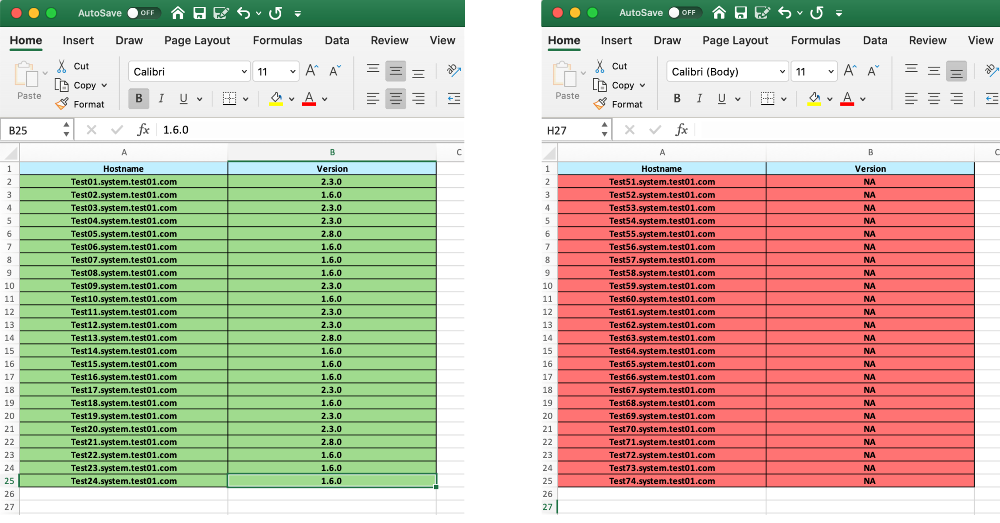

# Agent-Status-Checker

The new Qualys Agent Checker open-source tool helps security teams and VMware admins work together to ensure the security and compliance of VMware environments. Agent Checker provides a common understanding of the instrumentation of VMware virtual machines by reporting Cloud Agent deployment status for all VMware vCenter-managed virtual machines. Security and admin teams can then identify gaps and ensure that Cloud Agent is installed and running on all VMware virtual machines, so that Qualys Cloud Platform can secure the entire environment.

## Installation Comments

Agent-Status-Checker maintains multiple Ansible roles and modules that can be deployed to easily configure and manage various parts of the vmwarew and Linux infrastructure. Ansible roles & modules provide a method of modularizing your Ansible code, in other words; it enables you to break up large playbooks into smaller reusable files. This enables you to have a separate role for each component of the infrustructure, and allows you to reuse and share roles with other users. For more information about roles, see Creating Reusable Playbooks in the Ansible Documentation. Module and Roles included bunch of python codes, govc scripts, which help to generate dynamic inventory from vcenter and then getting agent status of all nodes and provided the except report.

### Currently we have implemented following Ansible roles:

- <code>get.vm-inventory</code> - login to vCenter from via goVC and generate the VM inventory in csv or excel fromat. 
- <code>get.vm-status</code> - login to vCenter from via goVC and generate the VM inventory with VM status, Running or poweroff.
- <code>get.agent-installed</code> - login to hosts with dynamic inventory and generare report where agent installed or where not.
- <code>get.agent-status</code> - login to hosts with dynamic inventory and generare report where agent is running where not.
- <code>get.agent-status-reporting</code> - login to hosts with dynamic inventory and generare report in excel format with multiple tabs where you can see VM Status, Agent installed and version, running status.


### Dependencies

1. For Linux:
    - Package Manager should be working
	
2. For Mac:
    
    [Latest Xcode should be installed](https://developer.apple.com/downloads/index.action)

3. For Windows: (In progress)
    - Cygwin should be installed with following packages.
        ```
        - ansible >= 2.8.4
        - python3 >= 3.6.10
        - wget    >= 1.19.1
        - pip3     >= 20.2.3
        ```
    [Cygwin dowload](https://cygwin.com/install.html)

 
### Running Agent-Status-Checker:


### Installing from a unzip:
<code>
unzip -d Agent-Status-Checker.zip
</code>

### Example

1. Go to Agent-Status-Checker/AgentStatusChecker.

    <code>cd Agent-Status-Checker/AgentStatusChecker</code>
    
2. Run install_me.sh

    <code>bash install_me.sh</code> or <code>./install_me.sh</code>

3. During script execuation it asks for some user input please follow the setup

    1. Promt for confirmation of Satisfied dependencies

    2. Take User Credentials

        - Username with sudo access:  <code>foo</code>
        - Password: <code>*****</code>

    3. After below message we have to enter password(please do not enter sudo password),please make sure password should be same for all three prompt.
       
        e.g
         - "Generate vault encrypted password from user credentials,Password should be same for all three prompt".
         - "Note: Please do not enter sudo password".
         
           - Enter password(foo): <code>*****</code>
           - New vault password (foo): <code>*****</code>
           - Confirm new vault password (foo): <code>*****</code>
 
    4. Enter Govc Credentials for login

       - Please input the number of GOVC URLs: <code>X</code>
       - Please input your GOVC IP 1 : <code>x.x.x.x</code>
       - Please input your GOVC username 1 : <code>xyz</code>
       - GOVC password 1 : <code>****</code>

### Output Example
##### VMware Environment: 


##### ExcelSheet Output: 


Agent Checker output showing VMware virtual machines with Cloud Agent running (left) and not installed (right).

### Contributors
```
Purushottam Soni, Vivek Sharma, Cody Yu, Junjie Lu
```
